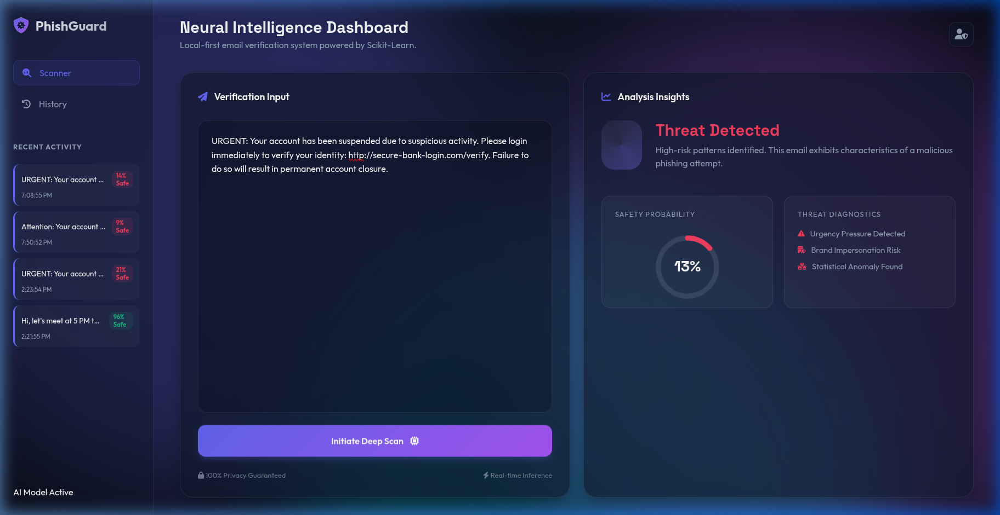
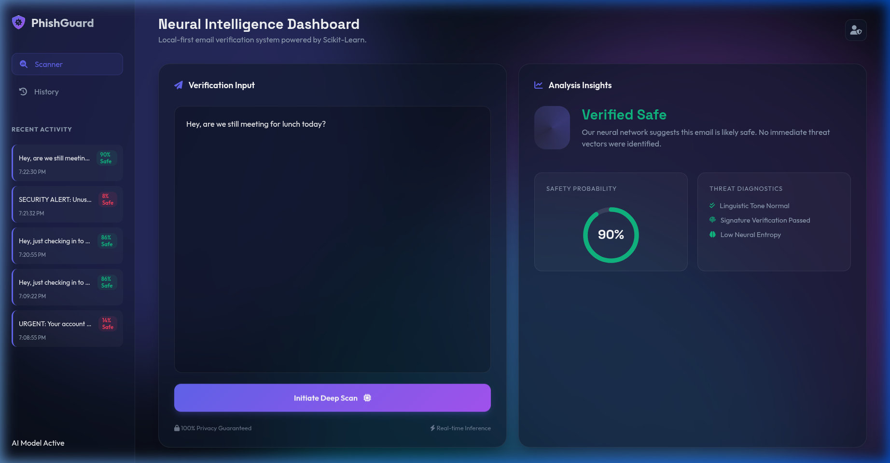

<div align="center">

# 🟣 PhishGuard AI — Phishing Email Detector

<p align="center">
  
  
  
  
  
</p>

<p align="center">
  
  
  
  
</p>

<br/>

> **Local AI-powered phishing email detection** — runs 100% on your machine.  
> No data ever leaves your device. Naive Bayes ML model + FastAPI backend + premium Glassmorphism UI.

<br/>

**[🚀 Quick Start](#-quick-start-guide) • [📸 Screenshots](#-visual-highlights) • [🧠 How It Works](#-how-it-works) • [🛠 Tech Stack](#️-tech-stack)**

</div>

---

## 🎥 Demo

<div align="center">


*Real-time phishing detection with neural analysis UI*

</div>

---

## 📸 Visual Highlights

<div align="center">

| 🚨 Phishing Detected | ✅ Safe Email Verified |
|:---:|:---:|
|  |  |
| *High-confidence phishing alert with threat breakdown* | *Clean email verification with trust score* |

</div>

---

## ✨ Features

| Feature | Description |
|---------|-------------|
| 🧠 **Local ML Model** | Multinomial Naive Bayes via scikit-learn — fast & accurate |
| ⚡ **FastAPI Backend** | High-performance REST API for real-time inference |
| 🔒 **100% Private** | Runs completely offline — your emails never leave your machine |
| 🎨 **Premium UI** | Glassmorphism design with animated blobs and smooth transitions |
| 📊 **Confidence Score** | Shows exact threat probability with visual risk meter |
| 🔍 **Pattern Analysis** | Detects phishing keywords, suspicious links, and sender patterns |
| 📋 **Detailed Report** | Full breakdown of what triggered the detection |

---

## 🧠 How It Works

```
User pastes email content
         ↓
FastAPI receives text via POST /analyze
         ↓
scikit-learn Naive Bayes model runs inference
         ↓
Returns: classification + confidence score + threat indicators
         ↓
Frontend renders result with risk visualization
         ↓
✅ Safe | 🚨 Phishing — all processed locally, zero data sent externally
```

---

## 🛠️ Tech Stack

```
ML Model:  scikit-learn · Multinomial Naive Bayes · pandas · numpy · joblib
Backend:   FastAPI · Uvicorn · Pydantic
Frontend:  Vanilla HTML5 · CSS3 (Glassmorphism) · Vanilla JS · FontAwesome
Privacy:   100% offline — no external API calls for analysis
```

---

## 🚀 Quick Start Guide

### 1. Prerequisites
- Python 3.10+

### 2. Installation

```bash
# Clone the repository
git clone https://github.com/builtbysardor/-Phishing-Email-Detector-.git
cd Phishing-Email-Detector

# Install dependencies
pip install -r requirements.txt
```

### 3. Train the Model

```bash
# Generate synthetic training dataset
python3 ml/generate_data.py

# Train and save the Naive Bayes model
python3 ml/train_model.py
```

This creates:
- `data/phishing_dataset.csv` — training data
- `ml/model.joblib` — trained classifier
- `ml/vectorizer.joblib` — TF-IDF vectorizer

### 4. Start the Backend

```bash
uvicorn backend.main:app --reload
```

API available at `http://localhost:8000` | Docs at `http://localhost:8000/docs`

### 5. Open the Dashboard

```bash
# Simply open in your browser
open frontend/index.html
```

Paste any email content and click **"Analyze Email"** — see the AI in action! 🎯

---

## 📡 API Reference

| Method | Endpoint | Description |
|--------|----------|-------------|
| `POST` | `/analyze` | Analyze email text, returns classification + confidence |
| `GET` | `/health` | API health check |
| `GET` | `/docs` | Interactive Swagger UI |

**Request example:**
```json
POST /analyze
{
  "email_text": "URGENT: Your account has been compromised. Click here now..."
}
```

**Response example:**
```json
{
  "classification": "phishing",
  "confidence": 0.97,
  "risk_level": "HIGH",
  "indicators": ["urgent language", "suspicious link", "account threat"]
}
```

---

## 📁 Project Structure

```
Phishing-Email-Detector/
├── ml/
│   ├── generate_data.py    # Synthetic dataset generator
│   ├── train_model.py      # Model training script
│   ├── model.joblib        # Trained Naive Bayes classifier
│   └── vectorizer.joblib   # TF-IDF vectorizer
├── data/
│   └── phishing_dataset.csv
├── backend/
│   └── main.py             # FastAPI application
├── frontend/
│   ├── index.html          # Dashboard UI
│   ├── style.css           # Glassmorphism theme
│   └── app.js              # Frontend logic
├── assets/
│   ├── phishguard_demo.webp
│   ├── phishing_threat_detected.png
│   └── safe_email_verified.png
├── requirements.txt
└── README.md
```

---

## 🔮 Roadmap

- [ ] 🔗 **URL scanner** — check embedded links against phishing databases
- [ ] 📎 **Attachment analysis** — scan email attachments for malware
- [ ] 📧 **IMAP integration** — connect directly to your email inbox
- [ ] 🧠 **Model upgrade** — BERT/transformer-based classifier for higher accuracy
- [ ] 🐳 **Docker support** — one-command deployment
- [ ] 📊 **History dashboard** — track past analyses and threat trends

---

## ⚠️ Disclaimer

This tool is for **educational and personal security use only**. The ML model is trained on synthetic data and may not catch all real-world phishing attempts. Always verify suspicious emails through official channels.

---

## 📄 License

MIT License — see [LICENSE](LICENSE) for details.

---

<div align="center">

**Built with ❤️ by [Sardor Buriyev](https://github.com/builtbysardor)**

⭐ **Star this repo if it helped protect you!**

</div>
