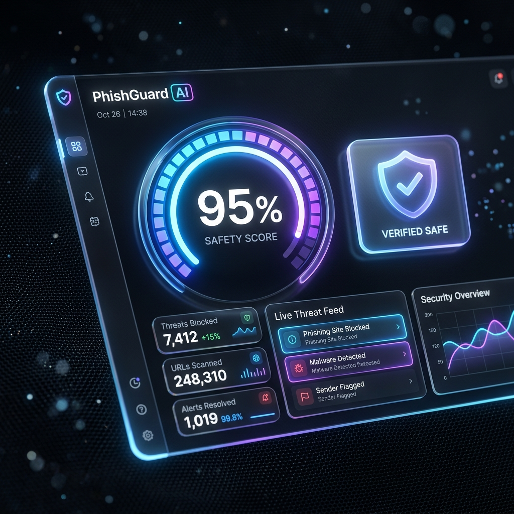

# 🟣 Phishing Email Detector (Premium Edition)

> 🛡️ **Advanced, local AI-powered phishing email detection system with a stunning Glassmorphism interface.**



## 🎥 Visual Highlights

### Neural Analysis Results
| Phishing Detection (Threat) | Safe Email Verification |
| :---: | :---: |
|  |  |

This project is a 100% legal, locally-run Machine Learning project designed to classify emails as either **Safe** or **Phishing**. By running completely on your local machine, it ensures absolute privacy—no sensitive email data ever leaves your computer!

## ✨ Features
- 🧠 **Local Machine Learning**: Scikit-Learn based Multinomial Naive Bayes model for fast and accurate classification.
- ⚡ **FastAPI Backend**: High-performance RESTful API providing real-time inference.
- 🎨 **Premium UI**: Experience a breathtaking "WOW" factor using dynamic CSS Glassmorphism, blurred animated blobbies, and layout transitions.
- 🔒 **Privacy First**: 100% offline capability. You hold the code, you hold the data.

---

## 🚀 Quick Start Guide

### 1. Requirements
Ensure you have Python 3.10+ installed.

### 2. Installation
Clone the repository and install dependencies:
```bash
git clone https://github.com/yourusername/phishing-email-detector.git
cd "phishing-email-detector"
pip install -r requirements.txt
```

### 3. Training the Model
Before running the backend, generate the dataset and train the model locally:
```bash
python3 ml/generate_data.py
python3 ml/train_model.py
```
This will generate `data/phishing_dataset.csv` and output trained `.joblib` files to the `ml/` folder.

### 4. Running the Backend Server
Start the FastAPI server:
```bash
uvicorn backend.main:app --reload
```
The API will be available at `http://localhost:8000`.

### 5. Launching the Interface
Simply open `frontend/index.html` in your favorite modern browser (like Google Chrome). Paste an email into the input field and hit "Analyze Email" to see the Magic!

---

## 🛠️ Tech Stack
- **Machine Learning**: `scikit-learn`, `pandas`, `numpy`, `joblib`
- **Backend API**: `FastAPI`, `Uvicorn`, `Pydantic`
- **Frontend**: Vanilla HTML5, CSS3 (Glassmorphism), Vanilla JavaScript, FontAwesome

## 📝 License
MIT License - Free to use for your portfolio, research, and non-commercial purposes.
